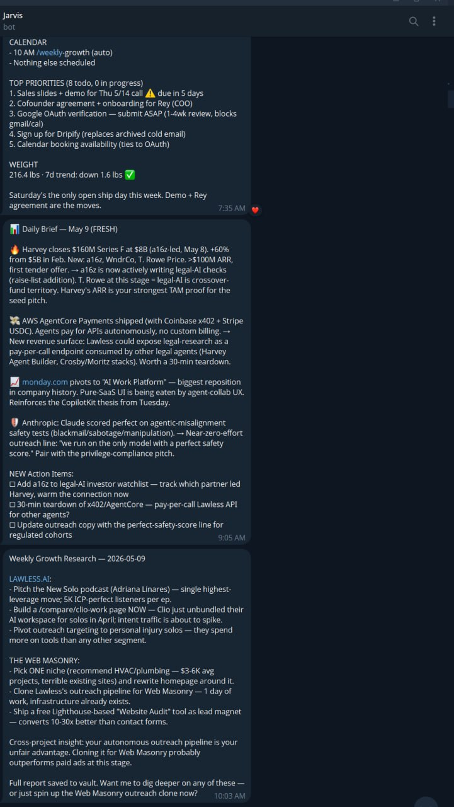
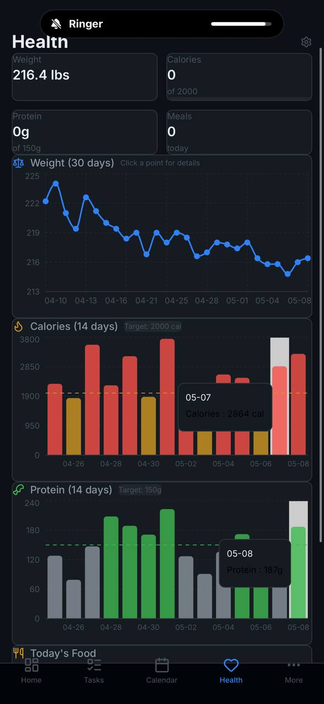
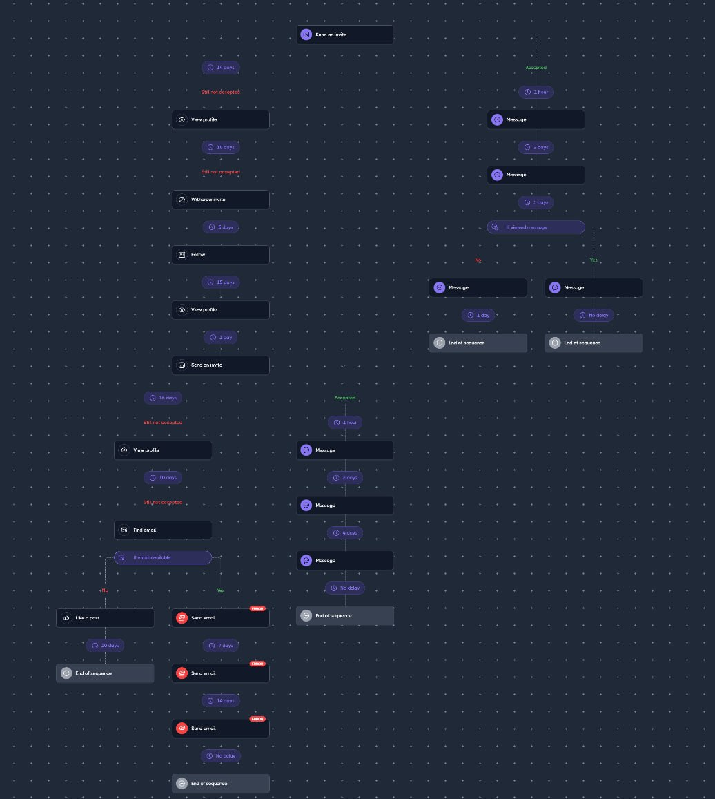

<p align="center">
  
</p>

<h1 align="center">Jarvis</h1>

<p align="center"><em>My personal assistant. Automates the daily tasks that have to get done so I can spend my time on the work that doesn't yet.</em></p>

<p align="center">
  
  
  
</p>

---

## What this is

A weekend build for AI Builder Day's "Give Yourself a Promotion" hackathon (May 2026).

Jarvis is the persistent Claude Code agent I've been running on a DigitalOcean VPS since February. It's been my chief of staff for months: morning digest at 7:35 AM with calendar + priorities + weight, daily brief at 9:05 AM with market intel and action items, weekly growth research, nighttime ideas, food and weight tracking, vault knowledge capture, code regression scans. The picture below is a real Saturday morning conversation — not a demo, just three back-to-back Jarvis messages I read on my phone before coffee.

<p align="center">
  
</p>

This weekend I extended Jarvis into a marketing operations layer for Caseread.ai, my AI legal research product. Same architecture, new skills. The same Jarvis that wakes me up with a digest and tracks my deficit days now also drafts my LinkedIn posts, runs Friday content reflections, pulls Sunday-evening competitive intel, monitors Sentry, and audits the codebase for regressions.

The promotion I gave myself: I fired the version of me that was hand-drafting LinkedIn posts at 11pm and chasing competitive intel by browser tab. Jarvis does that work now. I review, edit, ship. ~10 hours back per week.

> "AI killed cold email. So I revived Jarvis to automate the marketing channels that still work."

## The story

For most of 2025 and into early 2026, cold email worked. We ran an autonomous outreach pipeline against a list of solo and small-firm attorneys for Caseread (then called Lawless). It was the right channel for a while.

Then it wasn't. Bounce rates climbed past 30%. Reply rates collapsed under 0.25%. The mailbox providers got smarter, and cold email got drowned in AI-generated outreach noise. We paused the pipeline on May 1. The OutreachBot repo is archived. That channel is over for us.

The channels that still work for legal-tech founders are LinkedIn content and human-warmed connection campaigns through Dripify. Both demand voice. Both demand consistency. Both eat a founder's time. So I pointed Jarvis at them. The skills in this repo generate LinkedIn drafts in my voice three mornings a week, run a Friday content reflection, and pull a Sunday-evening competitive intel scan. They post nothing without me. I read everything on my phone via Telegram and ship what's worth shipping.

## What I built this weekend

- `linkedin-post` slash command, scheduled M/W/F 9 AM via cron. Generates 3 distinct LinkedIn drafts to Telegram with a diversity rule, a humanizer pass, a zero-em-dash policy, 9 structural templates, and a 23-post voice library as the tone anchor.
- `content-reflection` slash command, scheduled Fri 4 PM. Pulls the week's drafts, summarizes pillar / template / angle distribution, frames an engagement-learning prompt, saves the reflection to the vault.
- `competitive-intel` slash command, scheduled Sun 8 PM. WebSearches legal-AI news from the past 7 days, synthesizes a 3-paragraph Telegram brief on launches / people / funding, saves it to the vault.
- `sentry-monitor` slash command, scheduled Sat 12 PM. Pulls the past 7 days of Sentry issues, groups by severity, surfaces hot errors and new-this-week regressions, writes the report to the vault and sends a mobile digest to Telegram. Status: shipped this weekend, env-var pending Caseread Sentry account integration. Falls back gracefully to a "not configured" message until the token is set.
- `code-regression` slash command, scheduled Sat 12 PM. Read-only crawl of the Caseread codebase (routes, migrations, stack versions, commits, deletions). Diffs against last Saturday's snapshot to flag new routes shipped, migrations added, version drift, deleted-but-still-referenced files, and stubs that got promoted to shipped. Output mirrors the existing hand-written `ground-truth-2026-05-06.md` format. Status: shipped this weekend, functional immediately.
- MCP watchdog (1-min cron) that alerts me directly via the Telegram Bot API if the MCP child process dies.
- Vault-search hook on `UserPromptSubmit`. Pre-loads relevant vault notes before each Jarvis response so context lookups don't burn a turn.
- Journal-append hook on `Stop`. Auto-appends decisions and actions from the conversation to today's daily journal.
- Dehumidifier ruleset, extracted out of `linkedin-post` into a reusable skill. Em-dash zero-tolerance, banned-vocabulary list (delve, leverage, transformative, robust, seamless, unlock, game-changer, revolutionize), no duplicate closers across variants, sentence-fragment injection.

## How Jarvis actually runs

Jarvis is a single Claude Code agent process living in a `tmux` session named `jarvis` on a DigitalOcean droplet. The tmux session is the durability layer — when my SSH connection drops, when I close my laptop, when the network blips, Jarvis keeps running. I attach back when I need to talk to it directly.

Everything else clusters around that one process:

- **Telegram bot interface** — the primary input/output. Claude Code's plugin system (MCP) connects the agent to a Bot API channel I run on my own bot token. Inbound messages arrive as channel events the agent reacts to. Outbound replies go through the same channel. I read and write from my phone.
- **Tailscale** — the dashboard, vault, and SSH access live behind a Tailscale VPN. Mission Control at `100.78.49.99:3333` isn't on the public internet. Only my devices can reach it. No port forwards, no exposed services.
- **Memory vault** — `~/vault/` on the VPS, synced bidirectionally to a private GitHub repo (`second-brain-vault`). My phone runs Obsidian against the same repo. Whatever Jarvis writes to the vault — daily briefs, decisions, vault-search results, journal entries — shows up on my phone within seconds.
- **Skill loader** — every slash command (`/linkedin-post`, `/competitive-intel`, `/code-regression`, etc.) is a single Markdown file in `~/.claude/commands/`. Add a file, get a skill. Hot-reloaded by Claude Code. No build step, no deploy.
- **Cron + sandboxed subprocesses** — scheduled work fires through `cron`, which spawns a short-lived `claude -p "Run /skill"` subprocess. Each subprocess gets its own MCP server lifecycle. The long-running Jarvis poller and the cron-spawned ones coexist via a `TELEGRAM_NO_KILL=1` env var on the cron lines (a fix I patched in May 1 after a bug class where cron-spawned MCP children kept killing the persistent poller's connection).
- **Hooks** — Claude Code fires hooks on `UserPromptSubmit`, `Stop`, `PostCompact`, and `SessionEnd`. The vault-search hook greps the vault for keywords from my prompt and pre-loads the top 5 most-relevant excerpts as context before the agent responds. The journal-append hook appends decisions and action items to today's daily journal automatically. The watchdog hook on `MCP-down` fires a direct Telegram Bot API call (bypassing the dead MCP) so I find out within 60 seconds.
- **MCP watchdog** — a one-minute cron that checks `/proc/<bot.pid>/cwd` to verify the telegram MCP is alive. If it dies (the cron-bug class I patched), the watchdog uses `curl` directly against the Telegram Bot API to alert me. Self-healing was tested in production — it caught the May 6 incident before I would have noticed.
- **Stack** — Claude Sonnet 4.6 for drafting and reasoning, Claude Haiku 4.5 for cheap synthesis tasks (topic evaluation, classification). Python 3.11 + FastAPI for webhook handlers. Bun for Mission Control's React dashboard. Caddy for HTTPS termination on the few exposed surfaces. SQLite for Mission Control's local state.

A technical judge can read this section as the architectural answer to "what makes this more than a chatbot wrapper." It's a real always-on system with backpressure handling, durability, and self-healing — built incrementally over three months and extended this weekend.

## Why Claude Code specifically

Most "AI assistants" are wrappers around a chat API. They can talk about code. They can't see it. They can suggest fixes. They can't apply them. For a technical founder, that gap is the entire difference between a toy and a real assistant.

Jarvis runs on Claude Code, which is structurally different:

- **It can read my code.** Caseread.ai's repo is on the same VPS. The `code-regression` skill walks routes, migrations, package versions, and recent commits every Saturday. It sees what shipped, what broke, what got renamed, what's stale — because the agent has filesystem access, not just an OpenAPI spec.
- **It can change my code.** When I found a false-positive in the outreach pipeline's quality-check layer at 11pm last week, I described it on Telegram. A subagent forked, read the file, identified the regex bug, refactored it, ran the smoke tests, committed, pushed. I approved the diff before the push. The whole loop took 7 minutes.
- **It catches things I'd miss.** The May 1 cron-vs-MCP bug class (where cron-spawned subprocesses kept killing the persistent telegram poller) was diagnosed by a Jarvis investigator agent that crawled the session JSONL, traced the orphaned-PID pattern, and reported back with the exact root cause. I would have burned half a day chasing that one manually.
- **It takes the wheel when I ask.** Telegram message before bed: *"Build the cron, push to GitHub, the hackathon's tomorrow."* I went to sleep. I woke up to a working repo with three commits, a smoke-tested cron, and a Telegram summary. Real subprocess execution, real filesystem, real git operations, real autonomy. Not a chatbot. An operator.

That's where this stops being an LLM in a chat window and starts being an executive assistant. The "Give Yourself a Promotion" hackathon theme stops being a metaphor at that point. Hiring this executive assistant *was* my promotion.

## Adding a new skill takes one minute

This is the line nobody talks about. Most automation tools — n8n, Zapier, Make — make you assemble logic out of nodes in a visual editor. A workflow that does "fetch X, parse Y, send Z" is twelve clicks and an afternoon of debugging when one of the nodes silently fails.

Adding a Jarvis skill is one Markdown file. The pattern is literally:

```bash
# 1. Drop a new skill — plain English, no DSL, no nodes
$EDITOR ~/.claude/commands/my-new-skill.md

# 2. Add a cron line
crontab -e
# 0 9 * * 1 ... claude -p "Run /my-new-skill" --allowedTools "..."
```

That's the whole loop. Hot-reloaded. No deploy. No build step. The skill file is plain English describing the steps, the tools the agent can use, and where output goes. Jarvis interprets the rest because the agent is an LLM, not a regex parser pretending to be a workflow engine.

Two real moments from this week:

- **Friday 11pm:** "ship a Sentry monitor + a code-regression skill, both running Saturday at noon." Loop: write two Markdown files, add two cron lines, smoke test. **25 minutes** from "can we do this?" to "it runs every Saturday." Wiring the same thing in n8n — Sentry connector → parse → format → Telegram → schedule — would have been an entire afternoon, plus the time spent debugging JSON-path expressions when an event field arrives in a different shape than the visual editor assumed.
- **Saturday 7am:** "weekly content reflection cron, Friday 4pm." Loop: one Markdown file, one cron line. **8 minutes**.

That speed is the actual unlock. The hackathon judges should read this section as the answer to "could a non-technical person actually use this?" Yes — because writing a Jarvis skill is closer to writing a memo than writing code. Jarvis is an AI assistant that makes adding new things *easy*, not just possible.

## What's coming next (skill backlog)

Each of these is one Markdown file plus one cron line. Build time: 1–3 hours each. Cumulative additional time saved when shipped: **~7 more hours per week**, on top of the 14.25 already saved.

- **Auto-newsletter to Caseread.ai users** — Jarvis drafts the weekly newsletter from the week's vault entries (decisions, beta feedback, market intel), sends to the subscriber list via the existing Gmail OAuth or a Resend integration. **~3 hrs/wk saved.** The hardest part is the user-list integration; the writing is already a solved problem the way `linkedin-post` is.
- **Direct LinkedIn auto-post** — once LinkedIn's OAuth scope is granted, Jarvis publishes the M/W/F drafts directly with a 60-second Telegram veto window. **~0.75 hrs/wk saved.** Replaces the current review-and-paste loop with review-and-tap.
- **Oura ring biometric integration** — pulls daily HRV, sleep score, recovery, and resting heart rate from Oura's API and folds it into the morning brief. Upgrades the burnout-monitor from a food-and-weight heuristic to a real physiological signal. **~0.5 hrs/wk and a sharper signal** — the kind of thing a senior advisor would tell me to look at, automated.
- **Multi-inbox monitoring + draft replies** — `collin@trylawless.com`, `collin@thewebmasonry.com`, plus personal Gmail. Jarvis triages by importance, drafts replies for the high-priority ones, sends to Telegram for one-tap approval. **~3 hrs/wk saved.** This is the highest-leverage item on the list because email is where every founder's day disappears.

Projected total once these ship: **~21 hrs per week saved**. That's twenty-six 40-hour workweeks per year — half of a full-time hire's annual capacity.

## Mission Control — the secondary dashboard

Telegram is the primary control plane. Mission Control is the secondary one — a self-hosted Bun + React dashboard (Tailscale-only) that visualizes the data Jarvis writes and reads. Health, tasks, calendar, messages, outreach metrics, all in one place, populated from the same source of truth that the cron jobs pull from.

The Health tab below shows live data: 30-day weight trend, 14-day calorie bar chart against the 2,000-cal target, 14-day protein chart against the 150g target. Every food entry logged via `/food` lands here. Every reading from `/weight` lands here. The morning digest cron pulls from this same database.

<p align="center">
  
</p>

Mission Control is part of Jarvis core (pre-existing). Weekend skills write to the same vault and database it reads from, so anything new the LinkedIn / intel / regression skills generate shows up next to the older food and weight data without extra wiring.

## Pre-existing (Jarvis core, running since Feb 2026)

This repo extends a runtime I've been running for months. None of the following was built this weekend:

- Persistent Claude Code on a DigitalOcean VPS
- Telegram bot interface (`plugin:telegram:telegram` MCP)
- Memory vault at `~/vault/`, Obsidian-synced via GitHub
- Skill loader (Claude Code's built-in slash command system)
- Authenticated Gmail OAuth, originally wired for the OutreachBot cold-email pipeline, now repurposed
- 9 daily and weekly cron jobs that pre-date this weekend (cleanup, daily-brief, morning-digest, nighttime-ideas, weekly-checkin, weekly-growth, research-task, friday-review, calendar-sync)

## Time saved per week

| Task | Before | After | Saved |
|---|---|---|---|
| LinkedIn drafting (3 posts/week) | 4.5 hrs | 0.5 hrs (review only) | 4.0 hrs |
| Connection follow-up triage | 1.5 hrs | 0.25 hrs | 1.25 hrs |
| Competitive intel scanning | 3.0 hrs | 0.25 hrs | 2.75 hrs |
| Content reflection / planning | 1.0 hrs | 0.25 hrs | 0.75 hrs |
| Codebase ground-truth audit | 1.0 hrs | 0.0 hrs (auto Sat 12 PM) | 1.0 hrs |
| Sentry error triage | 0.5 hrs | 0.0 hrs (auto Sat 12 PM) | 0.5 hrs |
| Ad-hoc agent dispatch (bug fixes, code edits, research scans) | 2.5 hrs | 0.5 hrs (review only) | 2.0 hrs |
| Health logging (food/weight via Telegram, voice memos transcribed + processed) | 1.0 hrs | 0.0 hrs | 1.0 hrs |
| Daily journal + decision capture (auto-append hook) | 0.5 hrs | 0.0 hrs | 0.5 hrs |
| Vault knowledge lookup (auto pre-loaded into every prompt) | 0.5 hrs | 0.0 hrs | 0.5 hrs |
| **Total** | **~16 hrs** | **~1.75 hrs** | **~14.25 hrs** |

### Why this number actually matters

14 hours a week is **728 hours a year** — eighteen 40-hour workweeks. That's the headline.

What it really means: I no longer draft LinkedIn posts at 11pm. I no longer spend Sunday morning catching up on legal-AI news through 30 browser tabs. I no longer burn an hour every Friday trying to remember what I posted that week. I don't open a calorie tracker — I tell Jarvis "I had two protein bars and a Cubby's Philly" and the database is up to date. I don't journal manually — the journal-append hook captures decisions and action items as they happen. I don't dig through old vault notes — the vault-search hook pre-loads them into Jarvis's context before I finish typing the question.

The cognitive switching tax — flipping out of "founder building product" mode into "marketer drafting content" mode 12 times a week — is gone. Jarvis owns those shifts. I review on my phone in the elevator and ship.

For a solo founder, the 14 hours isn't the win. The win is having those 14 hours fall in coherent, focused, unbroken blocks. That's what makes the difference between shipping product and shipping content. With Jarvis I get to ship both.

## Architecture

Telegram is the human approval layer. Cron-scheduled skills run inside Jarvis (Claude Code), pull from the memory vault, generate output, and ship it to me on Telegram for review. Webhooks (Dripify, future LinkedIn) flow back the same way. Full diagram and trust model in [ARCHITECTURE.md](./ARCHITECTURE.md).

## Dripify integration

The LinkedIn relationship layer runs through Dripify. The campaign sequence below is the production flow Caseread uses for solo-and-small-firm attorney outreach. Jarvis hooks into the connection-accepted, message-replied, and follow-up-due events and writes them to the memory vault, where the EOD digest cron synthesizes the day into a single Telegram digest.

### Why a third-party SaaS for the actual LinkedIn actions

LinkedIn aggressively flags accounts that look automation-heavy. Direct API automation, headless browser scripts on a VPS, and most homegrown approaches get the account restricted or banned. Dripify exists specifically as a protection layer — they run the connection requests, follows, and messages through their own residential-proxy infrastructure with the rate-limiting and behavioral patterns that keep accounts in good standing.

So I deliberately drew the line: Dripify owns the LinkedIn-touching surface. Jarvis owns content generation, event handling, and the EOD digest. Trying to build the LinkedIn dance into Jarvis directly would have put my actual LinkedIn account at risk. The webhook integration in [`handlers/dripify_webhook.py`](./handlers/dripify_webhook.py) is the bridge between the two.

<p align="center">
  
</p>

The flow:
- Send invite. Branch on Accepted / Still not accepted.
- Accepted path: 1-hour delay, then a 4-message cascade (1 hr / 2 days / 5 days / no-delay branch on viewed-message).
- Not-accepted path: 14-day wait, view profile, 19-day wait, withdraw invite, follow, second invite attempt at 15 days.
- Email-fallback branch when LinkedIn fails: find email, 3 send-email steps with 7-day and 14-day spacing.

The webhook handler that consumes these events lives in [`handlers/dripify_webhook.py`](./handlers/dripify_webhook.py). Currently stubbed — fills in Sunday morning once the Dripify account is provisioned.

## Demo

90-second walkthrough in [DEMO.md](./DEMO.md).

## Repo notes

This repo is the new code from this weekend. Jarvis core (the runtime, the Telegram bot, the memory vault, the skill loader) lives separately as personal infrastructure and is not committed here. Treat this repo as a hackathon-build extension, not the whole stack.

---

License: MIT. See [LICENSE](./LICENSE).
